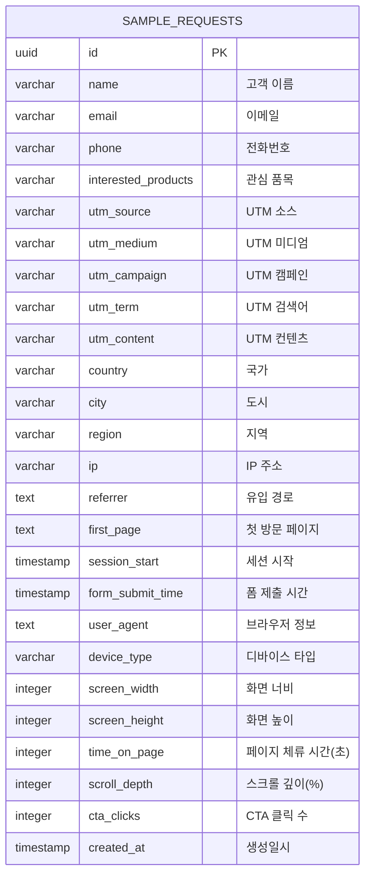
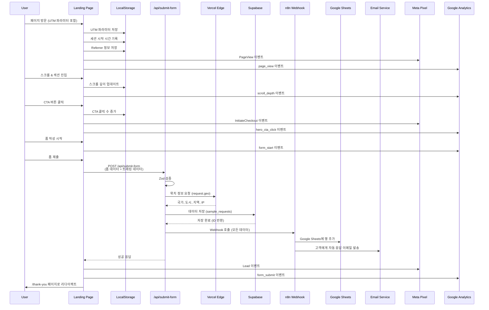
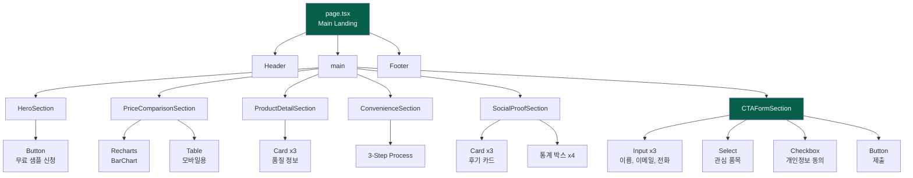
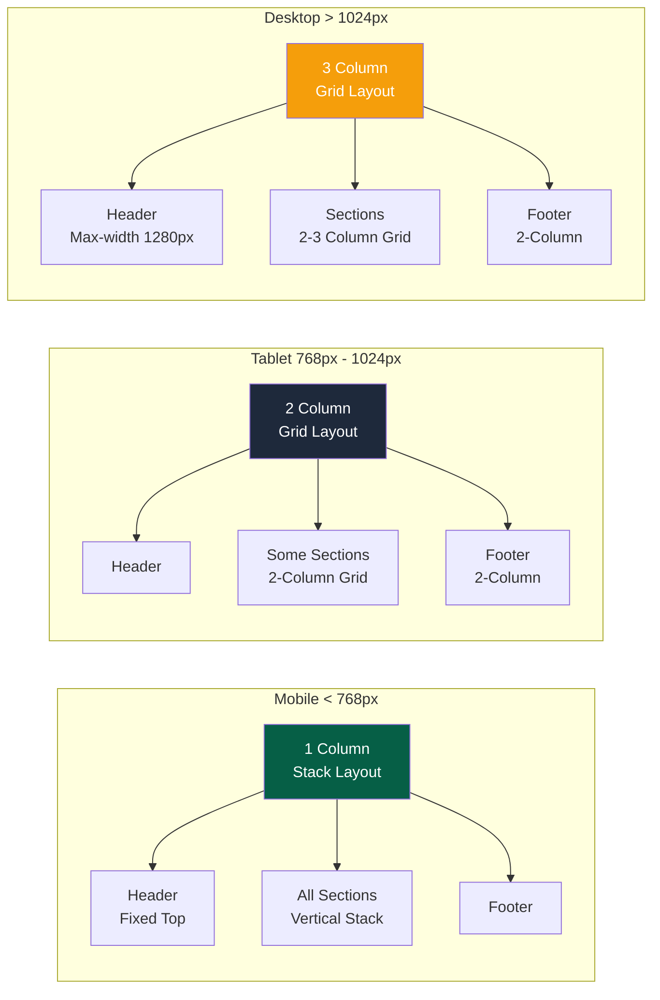
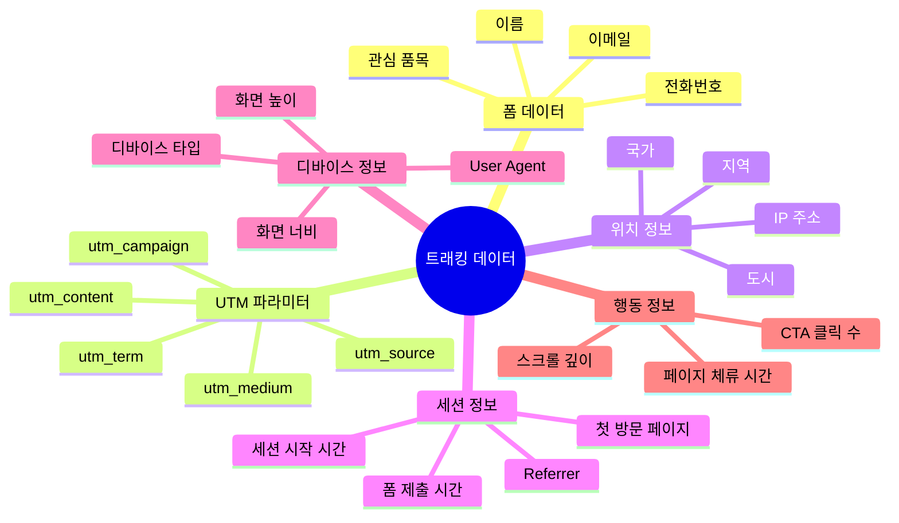
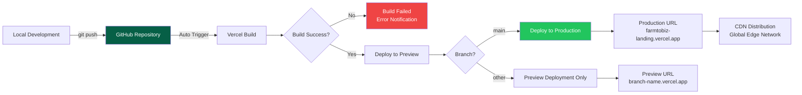
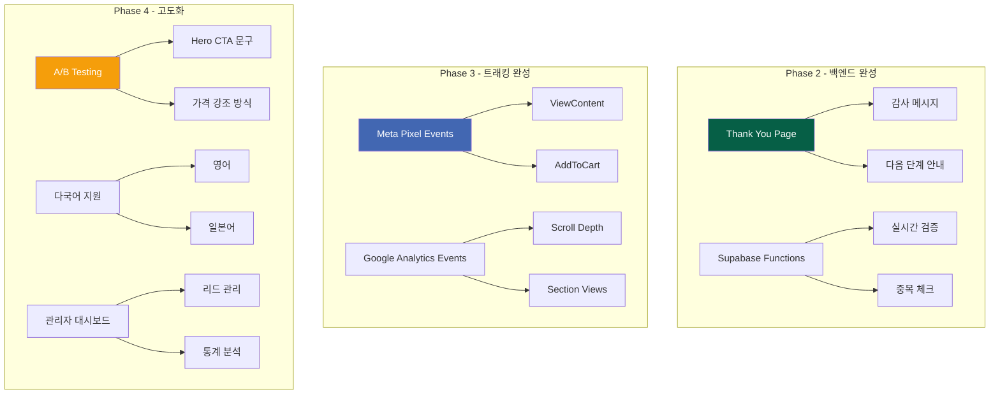
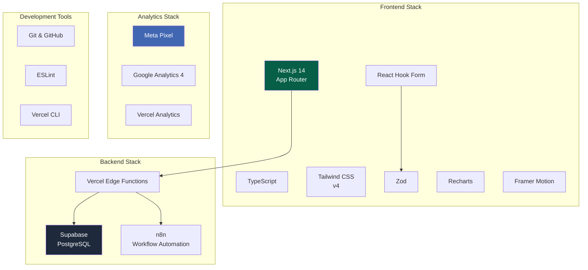

# 팜투비즈 랜딩페이지 - 아키텍처 다이어그램

## 📊 시스템 아키텍처

```mermaid
graph TB
    subgraph "Frontend - Next.js"
        A[Landing Page] --> B[Header]
        A --> C[Hero Section]
        A --> D[Price Comparison]
        A --> E[Product Detail]
        A --> F[Convenience]
        A --> G[Social Proof]
        A --> H[CTA Form]
        A --> I[Footer]

        H --> J[Form Validation<br/>React Hook Form + Zod]
        J --> K[Client-side Tracking<br/>UTM, Session, Behavior]
    end

    subgraph "API Layer"
        K --> L[/api/submit-form]
        L --> M[Server-side Validation<br/>Zod Schema]
        M --> N[Location Data<br/>Vercel Edge Geo]
    end

    subgraph "Backend Services"
        N --> O[(Supabase<br/>sample_requests)]
        N --> P[n8n Webhook]

        P --> Q[Google Sheets<br/>Lead Database]
        P --> R[Email Service<br/>Customer Notification]
    end

    subgraph "Analytics & Tracking"
        C --> S[Meta Pixel]
        C --> T[Google Analytics]
        K --> U[UTM Tracker<br/>LocalStorage]

        S --> V[Facebook Ads Manager]
        T --> W[GA4 Dashboard]
    end

    subgraph "Deployment"
        A --> X[Vercel CDN]
        X --> Y[GitHub Auto Deploy]
    end

    style A fill:#065f46,color:#fff
    style H fill:#065f46,color:#fff
    style O fill:#1e293b,color:#fff
    style P fill:#f59e0b,color:#fff
    style S fill:#4267B2,color:#fff
    style T fill:#E37400,color:#fff
```

---

## 🗄️ 데이터베이스 ERD (Supabase)



---

## 📁 프로젝트 구조 다이어그램

```mermaid
graph LR
    subgraph "marketing/"
        A[app/] --> A1[layout.tsx<br/>SEO & Meta]
        A --> A2[page.tsx<br/>Main Landing]
        A --> A3[globals.css<br/>Tailwind]
        A --> A4[api/]

        A4 --> A4a[submit-form/<br/>route.ts]
        A4 --> A4b[track-event/<br/>route.ts]

        B[components/] --> B1[layout/]
        B --> B2[sections/]
        B --> B3[ui/]
        B --> B4[tracking/]

        B1 --> B1a[Header.tsx]
        B1 --> B1b[Footer.tsx]

        B2 --> B2a[HeroSection.tsx]
        B2 --> B2b[PriceComparison<br/>Section.tsx]
        B2 --> B2c[ProductDetail<br/>Section.tsx]
        B2 --> B2d[Convenience<br/>Section.tsx]
        B2 --> B2e[SocialProof<br/>Section.tsx]
        B2 --> B2f[CTAForm<br/>Section.tsx]

        B3 --> B3a[Button.tsx]
        B3 --> B3b[Input.tsx]
        B3 --> B3c[Card.tsx]

        B4 --> B4a[MetaPixel.tsx]
        B4 --> B4b[GoogleAnalytics.tsx]
        B4 --> B4c[UTMTracker.tsx]

        C[lib/] --> C1[validation.ts<br/>Zod Schema]
        C --> C2[tracking.ts<br/>Utils]
        C --> C3[supabase.ts<br/>Client]

        D[types/] --> D1[form.ts]
        D --> D2[tracking.ts]

        E[public/] --> E1[images/]
    end

    style A fill:#065f46,color:#fff
    style B fill:#1e293b,color:#fff
    style C fill:#f59e0b,color:#fff
```



---

## 🔄 데이터 플로우 다이어그램



---

## 🎯 컴포넌트 계층 구조



---

## 📱 반응형 레이아웃 구조



---

## 🔐 폼 검증 플로우

```mermaid
flowchart TD
    A[사용자 폼 입력] --> B{React Hook Form<br/>실시간 검증}

    B -->|통과| C[제출 버튼 활성화]
    B -->|실패| D[에러 메시지 표시]

    C --> E[폼 제출 클릭]
    E --> F{Zod Schema<br/>클라이언트 검증}

    F -->|실패| G[에러 메시지 표시]
    F -->|통과| H[트래킹 데이터 수집]

    H --> I[API POST 요청]
    I --> J{Zod Schema<br/>서버 검증}

    J -->|실패| K[400 Bad Request<br/>에러 반환]
    J -->|통과| L[Supabase 저장]

    L --> M[n8n Webhook 호출]
    M --> N{n8n 처리}

    N -->|성공| O[200 Success]
    N -->|실패| P[서버 로그 기록<br/>사용자에게는 성공 반환]

    O --> Q[/thank-you 리다이렉트]
    K --> R[사용자에게 에러 표시]

    style F fill:#22c55e,color:#fff
    style J fill:#22c55e,color:#fff
    style K fill:#ef4444,color:#fff
    style G fill:#ef4444,color:#fff
```

---

## 📊 트래킹 데이터 수집 구조



---

## 🚀 배포 파이프라인



---

## 🔄 향후 추가 예정 구조



---

## 📋 기술 스택 다이어그램



---

## 📱 현재 배포 정보

- **Production URL:** https://marketing-5pguf4sc6-kimsoyeons-projects.vercel.app
- **GitHub Repository:** https://github.com/wngml080-stack/farmtobiz
- **Vercel Project:** kimsoyeons-projects/marketing
- **Branch:** main
- **Auto Deploy:** Enabled ✅

---

## 📝 다이어그램 렌더링 방법

### VSCode에서 보기
1. **Markdown Preview Enhanced** 확장 설치
2. 파일 열고 `Cmd+Shift+V` (또는 `Ctrl+Shift+V`)

### GitHub에서 보기
- GitHub은 Mermaid 다이어그램을 자동으로 렌더링합니다
- README.md나 이슈에 붙여넣기만 하면 됩니다

### 온라인 에디터
- https://mermaid.live
- 위 사이트에서 코드 복사 후 붙여넣어 실시간 미리보기

---

## 🎨 다이어그램 색상 가이드

- 🟢 **Green (#065f46)**: Primary 컴포넌트, 중요 노드
- 🔵 **Navy (#1e293b)**: Secondary 컴포넌트, 데이터베이스
- 🟠 **Orange (#f59e0b)**: 유틸리티, 설정 파일
- 🔴 **Red (#ef4444)**: 에러, 실패 상태
- 🟢 **Light Green (#22c55e)**: 성공, 통과 상태
- 🔵 **Blue (#4267B2)**: 외부 서비스 (Facebook, Analytics)
